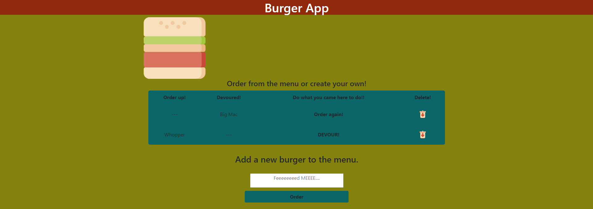
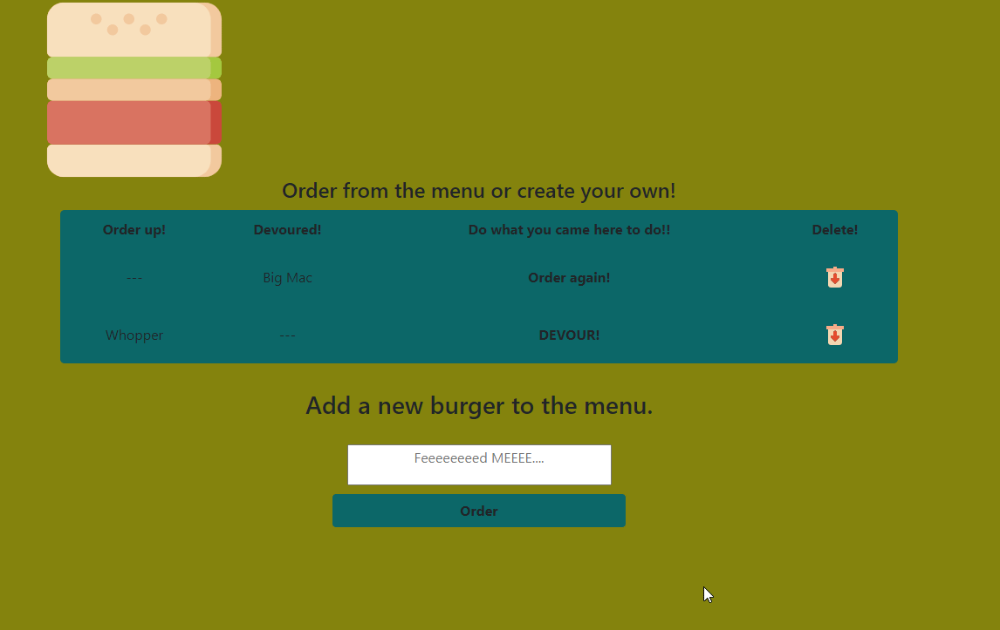

# Burger App 
- [Demo](#demo)
- [Description](#description)
- [Installation](#installation)
- [Usage](#usage)
- [Tech Stack](#tech-stack)
- [license](#license)
- [Contributing](#contributing)
- [Questions](#questions)

  ## Demo
    
    
     [Check out the site being hosted here!](https://calm-dawn-79357.herokuapp.com/)
  ## Installation
  npm install, setup DB and install schema and add some data to check the output.

  ## Usage
  This was very much just an idea of a simple templating language, first time using anything like this. 

  ## Tech Stack
  NodeJS
  MySQL
  HandleBars
  JawsDB
  MVC

  ## License
    
    

  ## Contributing
  Contact me

  ## Questions
  you can find my github profile here: https://github.com/calebkirkish
  If you have any questions about my projects you can contact me: caleb.kirkish@gmail.com
    
